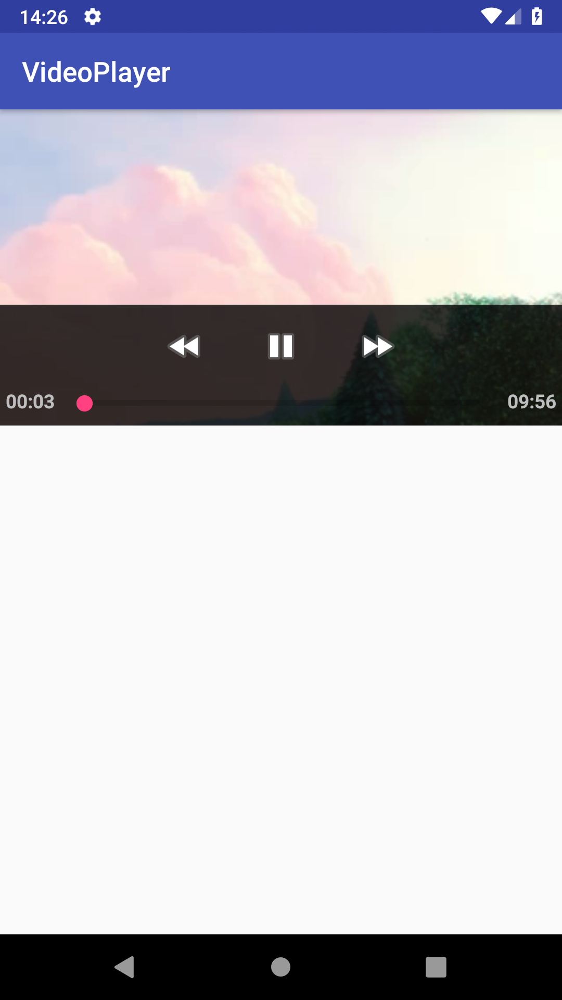

# Video Player
Android videoview implementation with default media controller.

This is a simple application using the [VideoView](https://developer.android.com/reference/android/widget/VideoView) controller. If you rotate the device the video will became in fullscreen mode.

# Screenshot

